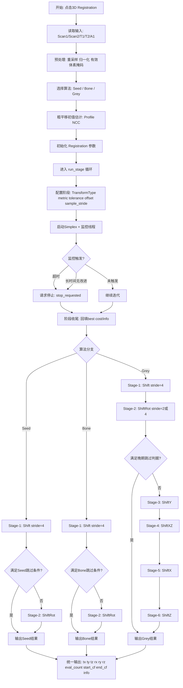
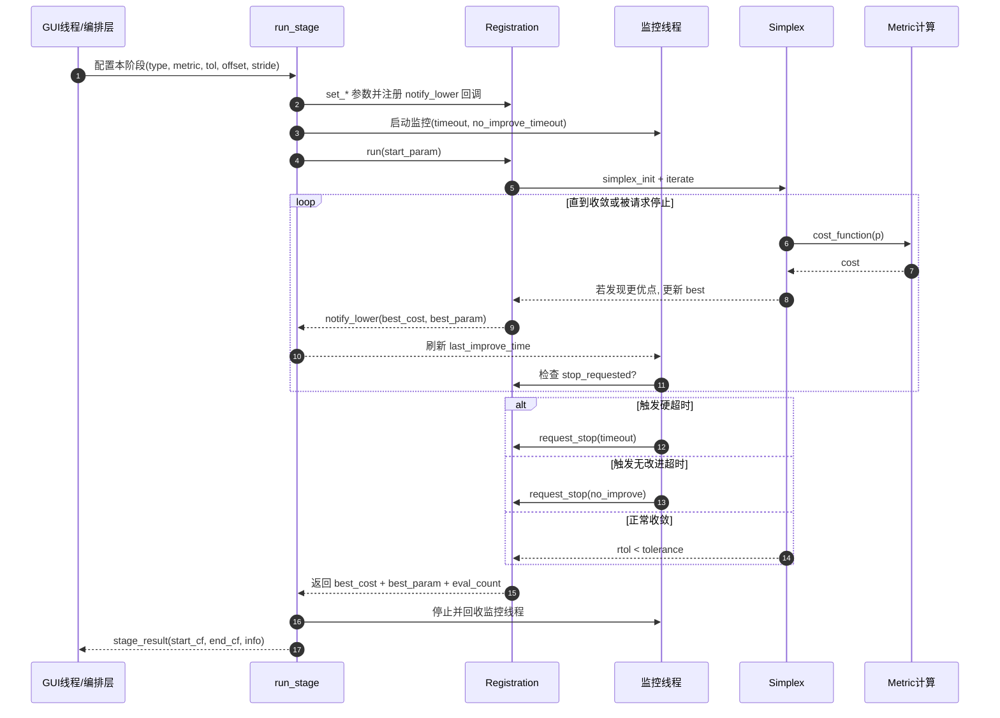

# 3D 配准算法逻辑说明（Seed / Bone / Grey value）

本文档对应 `src/registration` 目录下当前实现，重点解释：

- 配准内核数据流与变换链路
- 代价函数（metric）如何定义为“最小化问题”
- Seed、Bone、Grey value 三种算法在 GUI 线程中的分阶段策略
- 早停策略（超时与无改进）与稀疏采样加速

## 1. 总体架构

当前实现分成两层：

- 编排层：`registration_main.cpp`
  - 负责读取体数据、选择算法、按阶段调用 `registration::Registration`
  - 负责日志、超时、阶段跳过逻辑
- 求解层：`registration.cpp/.h`
  - 负责参数向量到 4x4 变换矩阵映射
  - 负责重采样、代价计算、Simplex 优化

## 2. 变换与配准管线

### 2.1 变换参数化

`TransformType` 支持以下常用模式：

- `kShift`：3 维平移参数（dx, dy, dz）
- `kShiftRot`：6 自由度（dx, dy, dz, rx, ry, rz）
- `kShiftY` / `kShiftX` / `kShiftZ`：单轴平移微调
- `kShiftXZ`：X/Z 双轴细调

参数单位约定：

- 平移参数按 `p/10` 转换为 mm
- 缩放参数按 `p/100` 转换为倍率

### 2.2 复合变换链

代价函数内部使用如下链路：

`Scan1 = inv[T1] * inv[A1] * A2 * T2 * Scan2`

其中：

- `T1/T2/A1` 是已知先验变换
- `A2` 是优化目标

若设置旋转中心，则 `A2` 通过“平移到中心 -> 变换 -> 平移回去”的夹心形式构建。

## 3. 代价函数定义

`Registration::compute_metric` 统一返回“越小越好”的 cost。

### 3.1 Grey value（相关比）

- 使用 Correlation Ratio 评估灰度统计相关性
- 原始 CR 越大越好
- 转换为 cost：`cost = 1 - CR`

### 3.2 Seed（归一化互信息）

- 使用 NMI（Normalized Mutual Information）
- 原始 NMI 越大越好
- 转换为 cost：`cost = 1 / (NMI + eps)`

### 3.3 Bone（RMS）

- 使用灰度差均方根误差 RMS
- RMS 直接是“越小越好”的误差量

### 3.4 有效体素筛选

当 `exclude_zeros=true` 时，仅使用两幅图都非零的体素参与统计，减少边界背景对 metric 的干扰。

## 4. 优化器（Simplex）

使用 Nelder-Mead Simplex：

- 无需梯度，适配医学图像配准中常见的不平滑目标
- 迭代策略：反射、扩张、收缩、整体收缩
- 收敛判定：相对离散度 `rtol < tolerance`
- 支持异步停止（用于超时/无改进提前结束）

## 5. 分阶段算法编排（核心）

编排统一入口为 `run_stage(...)`：

- 每阶段设置：`TransformType`、`metric`、`tolerance`、`offset`、`sample_stride`
- 并行监控：
  - 总超时（timeout）
  - 无改进超时（no_improve_timeout）
- 实时回调最优 cost 与参数

### 5.1 Seed 算法流程

目标：先锁定平移，再决定是否做 6DOF 精修。

- Stage-1 `Shift`
  - 初始化：先做 profile NCC 粗平移估计
  - 常用参数：`sample_stride=4`，偏大步长
- 跳过条件（可直接结束）：
  - `stage1.end_cf <= 0.70`
  - `|Tx| <= 1.0` 且 `|Tz| <= 1.5`
- Stage-2 `ShiftRot`（若未跳过）
  - 在 Stage-1 结果上做 6DOF 精修

适用特点：对跨模态/灰度分布差异较明显场景，NMI 有更稳定表现。

### 5.2 Bone 算法流程

目标：利用结构差异误差（RMS）快速收敛。

- Stage-1 `Shift`
  - 使用粗平移估计作为初值
  - `sample_stride=4` 做快速搜索
- 跳过条件：
  - `stage1.end_cf <= 1.0`
  - 平移最大分量 `|T|max <= 0.5 mm`
- Stage-2 `ShiftRot`（若未跳过）
  - 6DOF 细化

适用特点：骨性结构明显、边缘与强度变化稳定时通常效率更高。

### 5.3 Grey value 算法流程（最细致）

目标：先做全局，再做轴向微调，尤其针对 Y 方向主偏差场景。

- Stage-1 `Shift`
  - 粗平移 + 大步长，`sample_stride=4`
- Stage-2 `ShiftRot`
  - 6DOF 全局细化（仍可保持稀疏采样）
- 晚期阶段跳过判据（Stage-2 后）
  - Stage-1 成本已较低
  - Stage-2 相对收益很小
  - 平移/旋转增量都很小
- Stage-3 `ShiftY`
  - 仅 Y 轴微调（针对纵向主残差）
- Stage-4 `ShiftXZ`
  - X/Z 双轴细调
- Stage-5 `ShiftX`
  - X 轴局部微调
- Stage-6 `ShiftZ`
  - Z 轴局部微调

适用特点：需要更高精度时，分轴细调可减少参数耦合带来的振荡。

## 6. 早停与性能优化策略

### 6.1 双重早停

每个阶段均可触发以下提前停止：

- 硬超时：达到阶段 timeout
- 静默超时：在一定时间内无更优 cost

### 6.2 稀疏采样 (`sample_stride`)

- 粗阶段使用 `stride > 1`，减少重采样与 metric 计算体素数
- 细阶段降低 stride（甚至回到 1）保障精度

经验上，体素数量约按 `1/stride^3` 缩减，显著影响每次 cost 评估耗时。

## 7. 输出与诊断

最终输出包括：

- 平移：`tx, ty, tz`
- 旋转：`rx, ry, rz`（由结果矩阵提取欧拉角）
- 评估次数：`eval_count`
- 代价变化：`start_cf -> end_cf`
- 阶段信息：`info`（包含各阶段摘要）

日志中建议重点关注：

- 每阶段是否发生真实 improvement
- 是否触发 timeout / no-improve-stop
- Stage skip 是否过于激进（可能牺牲精度）

## 8. 调参建议

- 速度优先：提高粗阶段 `sample_stride`，缩短 `timeout`
- 精度优先：降低 `tolerance`，保留更多晚期微调阶段
- 结果不稳定：适当增大 Stage-1 `offset` 或加强粗平移初值估计

---

如需继续扩展，可在本文档后续增加：

- 不同病例（头颈/盆腔等）参数模板
- 失败场景诊断清单（局部最优、低重叠、几何不一致）
- 自动调参策略（基于阶段收益自适应调整 timeout/stride）

## 9. 工程师版流程图（实现视角）

下面这张图按当前代码编排逻辑组织，强调三个核心点：

- 进入算法前先做预处理与初始值估计
- 每个阶段都受“超时 + 无改进”双重监控
- 不同算法在 Stage 数量、跳过条件、细调轴向上不同

读图要点：

- `run_stage` 是统一执行器，不同算法主要差别在“阶段计划 + 跳过规则”。
- `sample_stride` 体现“先快后精”：粗阶段大 stride 降低评估开销，末段再细化。
- 监控线程不改变优化器数学过程，只在满足工程约束（时间/收益）时请求提前停止。
- Grey 的后四个细调阶段本质是“降维解耦”，用于减少 6DOF 同步优化时的轴间耦合振荡。

## 10. 工程师版时序图（线程与回调）

下面时序图对应一次 `run_stage(...)` 的典型生命周期，重点展示：

- GUI 线程如何发起并等待阶段结束
- 优化线程如何循环评估 cost 并上报更优解
- 监控线程如何触发超时/无改进提前停止

### 10.1 排查性能瓶颈时看什么

- `eval_count` 很大但 `end_cf` 下降很慢：通常是步长/容差设置不匹配，或陷入局部平坦区。
- 单次阶段耗时长且 CPU 满载：优先检查 `sample_stride` 是否过小（过早用全分辨率）。
- 频繁 no-improve-stop：说明阶段收益不足，建议提高该阶段 stride 或直接启用跳过规则。
- timeout 经常触发：先检查初值质量（粗平移）再延长 timeout，避免盲目加时间。

### 10.2 排查“结果突然变差”时看什么

- 是否误触发阶段跳过（跳过条件过于激进）。
- metric 与数据场景是否匹配（Seed/NMI 对跨模态更稳，Bone 对结构强对比更快）。
- `exclude_zeros` 与输入体素掩码是否导致有效体素太少。
- 最近是否改动了 `offset/tolerance/stride` 组合，导致搜索空间或停止准则改变。

## 11. 坐标系跳转图（Frame-to-Frame，对应公式链路）

这部分专门对应下面这条链路：

`Scan1 = inv[T1] * inv[A1] * A2 * T2 * Scan2`

按工程实现可理解为：把 Scan2 中的点先送到公共参考系，应用待优化修正，再拉回 Scan1 体素坐标系做重采样。

等价点级公式：

`p1 = inv[T1] * inv[A1] * A2 * T2 * p2`

### 11.1 为什么是这个顺序

- 右乘约定下，最右边先作用，因此执行顺序是 `T2 -> A2 -> inv(A1) -> inv(T1)`。
- `T1/A1` 表示 Scan1 侧“走向公共参考系”的已知链路，映射回 Scan1 时自然要取逆。
- 整条链路最终落在 Scan1 网格上，才能在 `cost_function` 中与 Scan1 做逐体素统计。

### 11.2 与代价函数计算的直接关系

- `cost_function(p)` 里，参数向量 `p` 先构造 `A2`。
- 通过复合链路把 Scan2 重采样到 Scan1 空间，得到“变换后 moving image”。
- 再用选定 metric（CR/NMI/RMS）计算 cost。
- Simplex 迭代不断更新 `p`，本质就是不断更新链路中的 `A2`。

### 11.3 旋转中心的夹心构造（A2 内部）

若设置旋转中心 `c=(cx,cy,cz)`，`A2` 采用夹心形式：

`A2 = T(c) * M * T(-c)`

其中：

- `T(-c)`: 先把点移到以 `c` 为原点的局部坐标
- `M`: 在局部坐标执行旋转/缩放/平移参数变换
- `T(c)`: 再平移回原坐标

工程意义：

- 避免默认绕全局原点旋转导致“旋转带出大平移”
- 降低旋转与平移的参数耦合，提高收敛稳定性
- 对解剖结构中心附近的局部调整更可控

### 11.4 调试时如何快速核对链路是否正确

- 检查单位：平移是否统一 mm，角度是否统一度并在矩阵构造处正确转弧度。
- 检查方向：`inv(T1)` 与 `inv(A1)` 是否被误写成正向矩阵。
- 检查顺序：矩阵乘法一旦换序，结果会明显偏移（常见表现是 TY 趋势反向或漂移）。
- 检查中心：启用旋转中心时，`T(c)*M*T(-c)` 是否完整；缺一项会导致旋转轨迹异常。

## 12. 直白版说明（给非工程人员）

这部分不用工程术语，只回答一个问题：配准算法到底在干什么？

一句话：

- 它在把“当前这张三维图”慢慢挪位置、慢慢转角度，直到和“参考那张三维图”尽量重合。

可以把它理解成“自动对齐器”：

- 先把两份三维影像叠在一起
- 系统自动试很多种挪动和旋转
- 每试一次就打一个“重合分”
- 分数更好就沿着那个方向继续试
- 最后给出最合适的位置和角度

### 12.1 生活类比（最容易讲清）

类比 1：两张透明胶片对齐

- 你手里有两张印着人体轮廓的透明片
- 一张固定不动，另一张在上面慢慢推、慢慢转
- 当边缘和内部结构最对上时，就算配准成功

类比 2：手机地图上的“旧定位点”和“新定位点”

- 参考图像像旧地图
- 在线图像像你当前定位
- 算法在做的就是“把当前位置图层贴回旧地图对应位置”

类比 3：拼图最后一块

- 你不会只看颜色，也会看边界形状和邻接关系
- 算法也是如此：它不是盲目平移，而是根据“像不像”持续修正

### 12.2 三种算法的本质区别（不讲公式版）

三种算法都在做“对齐”，区别在于它们判定“像不像”的标准不同。

Seed（更看信息对应）

- 它关注的是两张图的“信息关系”是否一致
- 不要求同一点亮度一模一样
- 适合两张图亮暗风格不太一致的情况

Bone（更看数值差）

- 它直接比较差值，差越小越好
- 判断逻辑直接，通常速度较快
- 当骨性结构清晰、对比稳定时效果常常很好

Grey value（更看灰度对应规律）

- 它看的是灰度分布关系是否匹配
- 通常会做更细的阶段化微调
- 往往更精细，但在大体积数据上可能更耗时

### 12.3 给业务同事的超短总结

- Seed：抗“亮暗风格差”，更稳。
- Bone：看差值，直接快。
- Grey value：更细致，偏精调。

### 12.4 常见误解（非工程视角）

- 误解 1：配准就是把图平移一下。
  - 实际上还会旋转，必要时还会分阶段微调不同方向。
- 误解 2：算法跑得越久一定越准。
  - 不一定，超过某个阶段后可能收益很小，所以会有早停策略。
- 误解 3：三种算法只是名字不同。
  - 不是，它们的“评分标准”本质不同，所以在不同病例上表现会不同。
